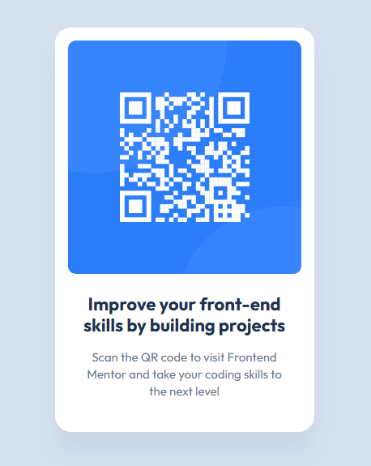

# Frontend Mentor - QR code component solution

This is a solution to the [QR code component challenge on Frontend Mentor](https://www.frontendmentor.io/challenges/qr-code-component-iux_sIO_H). Frontend Mentor challenges help you improve your coding skills by building realistic projects. 

## Table of contents

- [Overview](#overview)
  - [Screenshot](#screenshot)
  - [Links](#links)
- [My process](#my-process)
  - [Built with](#built-with)
  - [What I learned](#what-i-learned)
  - [Continued development](#continued-development)
  - [AI Collaboration](#ai-collaboration)
- [Author](#author)

## Overview

### Screenshot

### Links

- Solution URL: https://github.com/sanei-i/git-qrcode-component
- Live Site URL: https://qr-code-component-sanei-i.netlify.app/

## My process

### Built with

- HTML
- CSS
- Flexbox

### What I learned

I learned how to center elements using Flexbox.
I also learned how box-sizing and padding affect layout size.
Additionally, I learned how to inspect spacing and typography values in Figma.

### Continued development

I want to continue improving my CSS layout and responsive design skills.

### AI Collaboration

I used ChatGPT to learn about Flexbox, layout spacing, and inspecting values in Figma.

## Author

- GitHub - [sanei-i](https://github.com/sanei-i)
- Frontend Mentor - [sanei-i](https://www.frontendmentor.io/profile/sanei-i)
